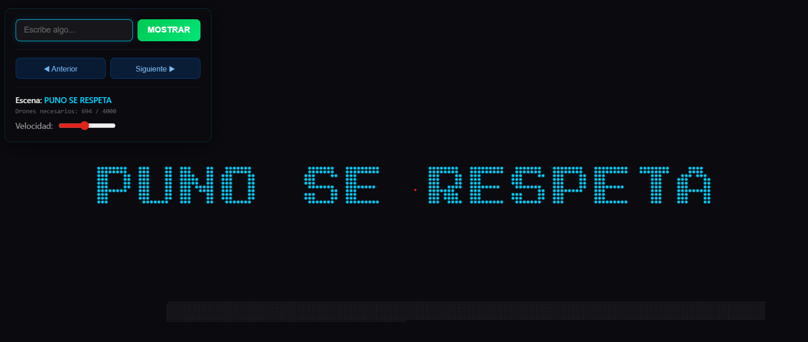

# PROGRAMA DE DRONES ORIENTADO A JS

Este repositorio contiene una simulación avanzada de un show de drones, diseñada para formar figuras y texto de manera coordinada.

## Lógica de JavaScript y Funcionamiento

El sistema se basa en un motor de simulación en tiempo real que utiliza las siguientes mecánicas:

1.  **Bucle de Animación (Pipeline):** Utiliza `requestAnimationFrame` para mantener una ejecución fluida a 60fps. En cada frame, se calculan las fuerzas de los drones, se actualiza su posición y se renderiza el resultado en un `<canvas>`.
2.  **Máquina de Estados del Dron:** Cada `Dron` tiene estados definidos (`EN_BASE`, `SUBIENDO`, `EN_POSICION`, `CAYENDO`). Esto permite una transición suave entre la base y las formaciones.
3.  **Interpolación de Movimiento:** Los drones no se teletransportan; utilizan cálculos de interpolación para moverse suavemente hacia sus objetivos, ajustando su velocidad dinámicamente.
4.  **Orquestador de Escenas:** Una clase central gestiona qué drones deben activarse para cada letra o figura, calculando los puntos de destino en tiempo real.

## Orientación de Programación

El proyecto sigue principios modernos de desarrollo de software:

-   **Programación Orientada a Objetos (POO):** Uso extensivo de clases (`Dron`, `Orquestador`, `Camara`, `Quadtree`) para encapsular datos y comportamiento.
-   **Arquitectura Modular:** El código está dividido en módulos de ES6, separando las preocupaciones de renderizado, lógica de negocio, estructuras de datos y configuración.
-   **Diseño Basado en Datos:** Las formaciones se generan a partir de datos de entrada (texto), lo que hace que el sistema sea flexible y escalable.

## Galería del Sistema

Aquí se muestra un ejemplar de los drones utilizados en la simulación:

### Vista del Dron

